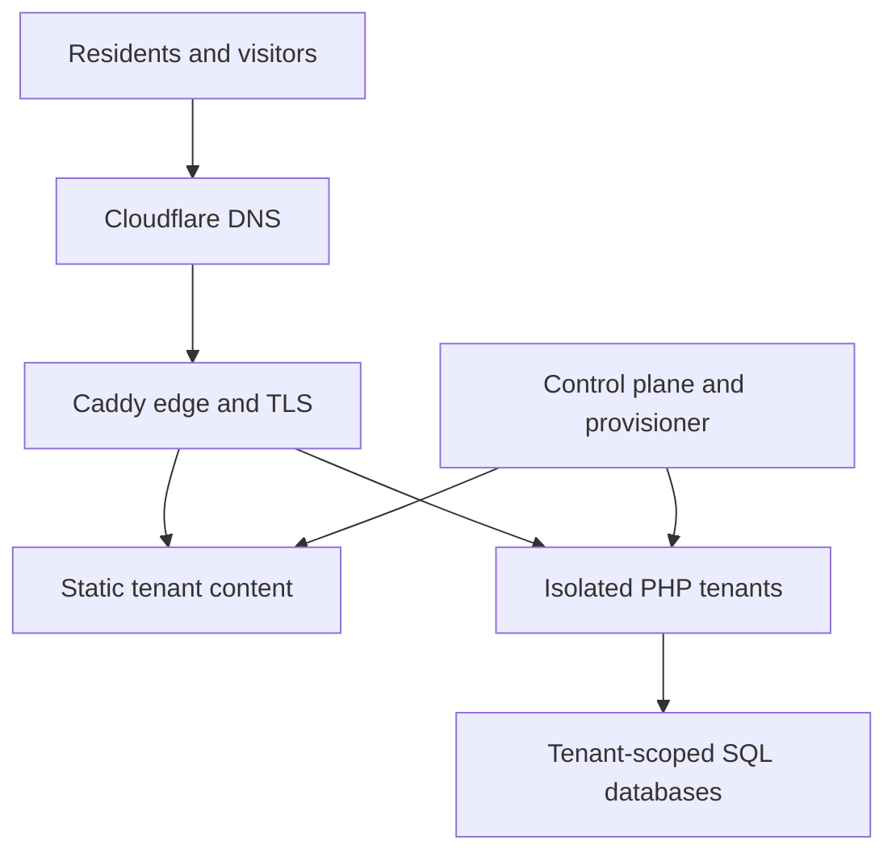
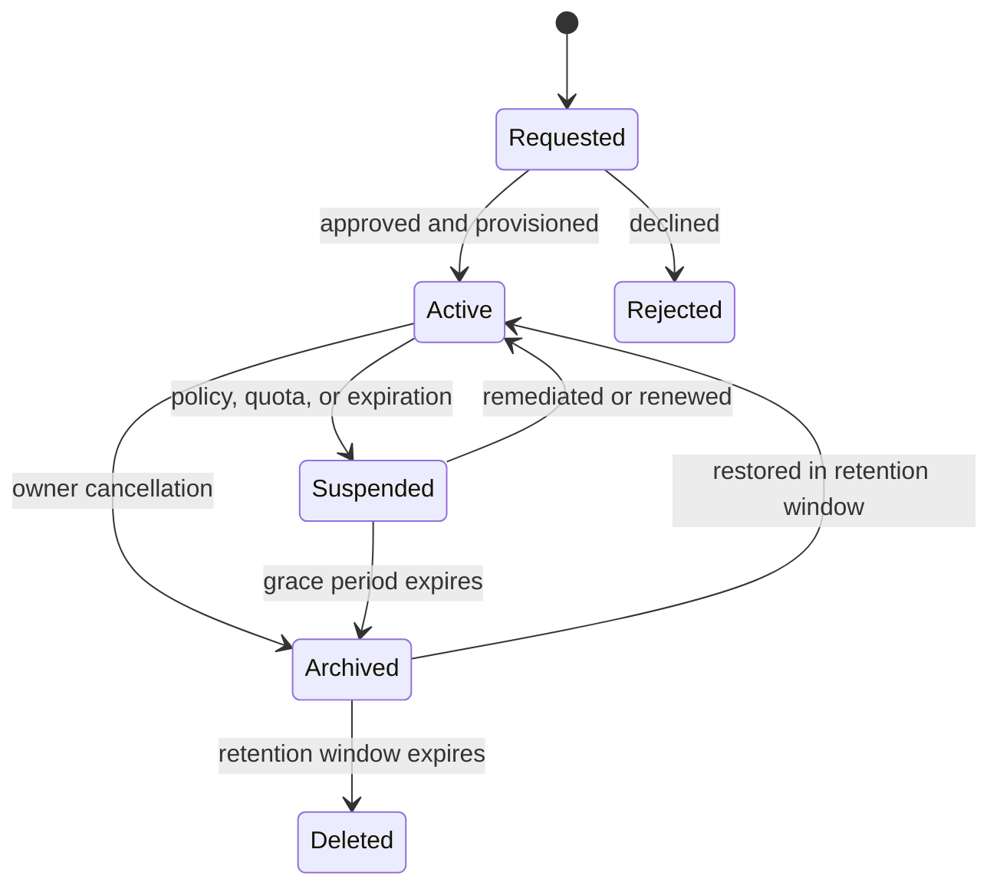

# Lower Duck Pond Hosting: Project Vision and Architecture

Status: proposed baseline for the initial public repository
Primary domain: `lowerduckpond.net`
First tenant: `lowerduckpond.com`

## 1. Project summary

Lower Duck Pond Hosting is a free, community-scale web host for participants in the [`r/HaveWeMet`](https://www.reddit.com/r/HaveWeMet/) role-playing community. It exists so residents of the fictional town of Lower Duck Pond can publish sites for imaginary businesses, civic departments, campaigns, clubs, events, personal pages, and other in-universe projects.

The intended spirit is closer to GeoCities than to a general-purpose cloud platform: personal, handmade, eccentric, and small. The first tenant, `lowerduckpond.com`, will be the town's official website—an aggressively dated municipal site whose idea of modern design stopped somewhere around the late 1980s or early 1990s.

This is also a portfolio and educational project. Infrastructure, platform code, documentation, tests, and operational practices should be public by default. Credentials, production state, private user data, abuse reports, and backup contents must remain private.

## 2. Goals

- Provision the DigitalOcean infrastructure from code.
- Automate signup, approval, provisioning, suspension, cancellation, archival, restoration, and eventual pruning.
- Provide authentic HTTPS for `lowerduckpond.net` and `*.lowerduckpond.net`.
- Make static hosting the safe, inexpensive default.
- Offer PHP and SQL as an explicitly higher-risk dynamic tier.
- Isolate dynamic tenants so one site cannot casually consume or inspect another site's resources.
- Prefer free and open-source software.
- Keep the initial system inexpensive and understandable on one Droplet.
- Preserve a credible path from one host to several tenant hosts without redesigning the entire application.
- Make platform behavior observable and auditable, particularly provisioning failures, resource abuse, and cross-tenant isolation.

## 3. Non-goals

- Competing with commercial shared-hosting companies.
- Supporting arbitrary long-running applications or arbitrary container images submitted by users.
- Providing shell access to tenants.
- Offering email hosting.
- Guaranteeing production-grade uptime or permanent archival.
- Building Kubernetes infrastructure for the initial release.
- Treating user-supplied PHP as inherently safe because it runs on a shared host.

## 4. Design principles

### 4.1 Separate three kinds of automation

The project uses three distinct automation layers:

1. **OpenTofu provisions infrastructure:** project resource assignments, the
   DigitalOcean VPC, Droplet, reserved IP, firewall, block/object storage, and
   related DNS resources. The existing project itself remains operator-owned.
2. **Ansible configures hosts:** packages, users, Caddy, Podman, Quadlet, database services, backup jobs, monitoring, and host security.
3. **The control plane manages tenants:** signup records, site manifests, deployments, credentials, lifecycle transitions, quotas, and routing entries.

Tenant signup should not run OpenTofu, and ordinary host configuration should not be embedded in a giant first-boot script. This separation makes each layer independently testable and prevents infrastructure state from becoming a tenant database.

### 4.2 Prefer rebuildable hosts over pet servers

The Droplet should contain as little irreplaceable state as practical. OpenTofu recreates infrastructure, Ansible recreates the host, tenant manifests recreate runtime configuration, and backups restore tenant data.

### 4.3 Static first, dynamic by policy

Static HTML, CSS, JavaScript, images, and other assets are the default product. PHP and SQL require stronger isolation, quotas, observability, and an explicit approval policy. Dynamic hosting may be enabled after the static path has proven stable.

### 4.4 Publish mechanisms, not secrets

Public repositories should include example variable files, schemas, workflows, policies, and generated configuration templates. They must not include OpenTofu state, API tokens, private keys, user data, database passwords, or production backup metadata.

## 5. System architecture

### 5.1 DigitalOcean infrastructure

The initial production environment consists of:

- One DigitalOcean project dedicated to Lower Duck Pond Hosting.
- One VPC for private service traffic and future expansion.
- One Basic Droplet, beginning at 1 vCPU/2 GiB during development and moving to
  the roughly 2-vCPU/4-GiB class before tenant onboarding.
- One reserved IP so the origin address survives Droplet replacement.
- One Cloud Firewall allowing public HTTP/HTTPS and tightly restricted administration.
- One Spaces bucket for encrypted backups and archived tenant bundles.
- Optional block storage if tenant content outgrows the root filesystem or hard per-tenant filesystem quotas become necessary.
- DigitalOcean monitoring for external host-level alerting.

DigitalOcean resources are represented by the official provider rather than console-only setup. The provider supports the project, Droplet, VPC, firewall, reserved-IP, volume, load-balancer, database, and Spaces resources needed for this growth path.

### 5.2 Host operating system

Use a current Ubuntu LTS or Debian stable image. First-boot cloud-init should do only enough to make the server manageable:

- Create the administrative automation account.
- Install Python and minimum prerequisites for Ansible.
- Install the administrative SSH key.
- Apply any boot-critical setting required before the first Ansible run.

Ansible owns all durable system configuration after that point.

### 5.3 Edge and routing

Caddy is the only public web entry point. It:

- Redirects HTTP to HTTPS.
- Terminates TLS.
- Serves static tenant directories directly.
- Proxies approved dynamic tenants to loopback-only container ports or sockets.
- Emits structured access logs tagged with the requested hostname and resolved tenant.
- Serves the provider portal and `lowerduckpond.com` as distinct virtual hosts.

The routing configuration is generated from tenant manifests. A bad tenant deployment must not be able to replace the entire Caddy configuration. The provisioner validates a candidate configuration before atomically installing and reloading it.

### 5.4 Tenant runtime

#### Static tier

A static tenant receives:

- A unique immutable tenant ID and mutable public slug.
- A content directory owned by the deployment service, not by the Caddy process.
- Read-only access from Caddy.
- File-count and storage quotas.
- A generated route for `<slug>.lowerduckpond.net`.
- No executable server-side code.

Static sites are inexpensive enough to remain online even when lightly visited. Lifecycle decisions should therefore be based primarily on owner activity and explicit renewal, not page views.

#### Dynamic PHP tier

Each PHP tenant receives a separately managed rootless Podman container, preferably under a dedicated non-login Unix account. Quadlet describes its systemd-managed lifecycle. The baseline container policy is:

- No privileged mode.
- No host container socket.
- No host networking.
- No added Linux capabilities unless explicitly required.
- `no-new-privileges` enabled.
- Read-only container root filesystem.
- Writable mounts limited to declared tenant data and temporary storage.
- CPU, memory, process, file-size, and request limits.
- Loopback-only published service endpoint.
- No outbound Internet access by default; exceptions are policy-controlled.
- No access to the DigitalOcean metadata endpoint.

Containerization reduces the blast radius, but user-supplied PHP remains user-supplied code execution. Dynamic hosting therefore requires more conservative quotas and faster suspension controls than static hosting.

### 5.5 SQL service

The initial SQL service may run on the same Droplet, provided its data and backups are treated as durable state. MariaDB is a natural fit for period-style PHP sites; PostgreSQL remains reasonable if the control plane would benefit substantially from sharing one database technology.

Regardless of engine:

- Each tenant receives a separate database and database user.
- Credentials grant access only to that tenant database.
- Administrative credentials never enter tenant containers.
- Connection counts, query duration, storage, and import size are limited.
- Database dumps are tested independently of whole-machine snapshots.
- Tenant cancellation disables credentials before data archival.

The database can later move to DigitalOcean Managed Databases without changing the public hosting contract.

### 5.6 Control plane and provisioner

The public web application should not run privileged container or filesystem operations directly. Split it conceptually into:

- **Control plane:** authentication, signup, site metadata, user-visible status, approvals, renewal, cancellation, and audit history.
- **Provisioner:** a narrowly privileged worker that consumes idempotent jobs and applies tenant manifests to the correct host.

The single-host implementation may deploy both components together, but their permissions and interfaces should remain separate. That boundary becomes the natural per-host agent interface when the platform grows.

Every provisioning operation should be idempotent and recorded with a correlation ID. Retrying `create site`, `suspend site`, or `archive site` must converge on the requested state rather than creating duplicate databases, credentials, containers, or routes.

## 6. DNS and HTTPS

Cloudflare remains the authoritative DNS provider. OpenTofu manages records such as:

- `lowerduckpond.net`
- `www.lowerduckpond.net`
- `*.lowerduckpond.net`
- Administrative or status hostnames

The wildcard record points to the DigitalOcean reserved IP. Caddy obtains and renews certificates for `lowerduckpond.net` and `*.lowerduckpond.net` through the ACME DNS-01 challenge using a narrowly scoped Cloudflare API token. Caddy requires a DNS provider module for this flow, so the project should build and pin its Caddy image rather than relying on an unversioned local binary.

`lowerduckpond.com` is configured as an ordinary independent tenant hostname and receives its own automatically managed certificate. Custom tenant domains can be considered later; they are not required for the initial service.

## 7. Tenant lifecycle

Recommended lifecycle behavior:

- Signup verifies ownership of the contact method and records acceptance of the hosting policy.
- Early releases use an administrative approval queue even if the rest of provisioning is automated.
- Renewal notices precede suspension; one missed message must not immediately destroy a site.
- Static sites can be archived much less aggressively than dynamic sites because their idle cost is negligible.
- Dynamic containers can be stopped while retaining files and database contents.
- Archival produces a portable tenant bundle containing site files, metadata, and an SQL dump when applicable.
- Deletion occurs only after a documented retention period and successful archival attempt.
- Owners can request an export without cancelling.

Exact inactivity and retention intervals should be configuration, not code constants. A reasonable pilot policy is owner confirmation every 90 days, a multi-notice grace period, and at least 90 additional days of recoverable archive retention.

## 8. Backups and recovery

Primary backups should be application-aware rather than relying only on Droplet snapshots:

- Restic encrypts tenant files, manifests, control-plane data, and SQL dumps into Spaces.
- Database dumps run before the corresponding Restic snapshot.
- Restic forget/prune expires backup generations according to policy; Spaces
  lifecycle rules remove incomplete uploads and stale object versions without
  deleting current repository objects by age.
- DigitalOcean Droplet backups or snapshots provide a secondary whole-machine recovery option.
- Restore tests run on a schedule and produce an auditable result.
- Tenant export and disaster recovery use the same archive format where practical.

Recovery objectives can remain modest for a free hobby service, but they should be explicit. The initial target should favor correctness and recoverability over short recovery time.

## 9. Observability and abuse detection

Use open-source observability for platform semantics and DigitalOcean monitoring for outside-the-host availability signals.

Capture at least:

- Host CPU, memory, disk, inode, network, and load metrics.
- Caddy request rate, response status, latency, bytes, and hostname.
- Per-container CPU, memory, process, restart, and network usage.
- Per-tenant stored bytes, file count, database size, and active connections.
- Provisioning queue depth, duration, failure reason, and retry count.
- Site state transitions and administrator actions.
- Backup age, backup failure, and most recent successful restore test.

Prometheus, Grafana, Alertmanager, and structured logs are suitable defaults. CrowdSec can consume edge and authentication logs for common hostile traffic. Runtime detection such as Falco can be evaluated after the container model is stable; it should not block the MVP.

Retention must balance abuse response with the privacy expectations of a small role-playing community. Administrative audit records and public access logs should have separate, documented retention policies.

## 10. Scaling path

### Stage 1: one host

- Caddy, control plane, provisioner, static content, PHP containers, and SQL run on one Droplet.
- Spaces stores backups and archives.
- Vertical resize is the first capacity response.

### Stage 2: separate durable services

- Move SQL to a dedicated Droplet or DigitalOcean Managed Databases.
- Move the control plane away from tenant execution nodes.
- Put tenant content on independently backed-up block storage or an object-storage-aware deployment model.

### Stage 3: several tenant nodes

- The control plane assigns each tenant to a node.
- A routing layer maps hostnames to the assigned node.
- Per-host provisioner agents reconcile tenant manifests.
- New nodes are created by OpenTofu and configured by the same Ansible roles.
- A DigitalOcean Load Balancer becomes appropriate only when the nodes behind it can satisfy the same request or when routing is deliberately centralized.

### Stage 4: specialize workloads

- Static content can move to object storage/CDN delivery.
- Dynamic tenants remain on isolated execution nodes.
- High-risk or unusually busy tenants can be placed on separate nodes or declined.

The first scaling trigger should be observed resource pressure or an operational bottleneck, not a speculative desire to distribute the system.

## 11. Public repository and secrets model

Commit:

- OpenTofu modules and environment templates.
- Ansible roles and playbooks.
- Caddy and Quadlet templates.
- Control-plane and provisioner source.
- Database migrations.
- CI workflows and tests.
- Example configuration with non-secret placeholder values.
- Architecture decisions, threat models, operating procedures, and restore reports with sensitive data removed.

Do not commit:

- `*.tfstate` or plan files containing sensitive values.
- DigitalOcean, Cloudflare, ACME, database, or backup credentials.
- Production inventories containing secrets.
- Tenant content or personal data.
- Raw production logs or abuse reports.

Use repository secret scanning and pre-commit checks from the beginning. Production changes should flow through reviewed CI jobs with a serialized OpenTofu apply step.

## 12. Repository boundary

Use at least two repositories:

1. **Hosting platform repository:** infrastructure, host configuration, control plane, provisioner, tests, documentation, and operational tooling.
2. **`lowerduckpond.com` repository:** the fictional city website's content and assets, deployed through the same tenant-facing mechanism offered to residents.

Keeping the first customer separate prevents the platform from receiving undocumented special cases and creates a genuine end-to-end example for other residents.

## 13. Principal risks and mitigations

| Risk | Mitigation |
| --- | --- |
| User-supplied PHP compromises another tenant | Static-by-default policy, per-tenant rootless containers, restrictive mounts, resource limits, no host socket, minimal network access |
| One tenant exhausts the host | Per-container limits, per-tenant quotas, alerting, administrative suspension, bounded request sizes and timeouts |
| Shared SQL leaks data | Separate database/user per tenant, least-privilege grants, no shared credentials, cross-tenant integration tests |
| Signup automation attracts abuse | Verified identity, initial approval queue, rate limits, clear acceptable-use policy and fast suspension tooling |
| Automated pruning destroys wanted content | Multi-stage suspension/archive/delete flow, repeated notices, configurable intervals, export and restore support |
| Infrastructure cannot be reproduced | OpenTofu, Ansible, pinned dependencies, tested restores, minimal manual console configuration |
| Public source exposes production secrets | Secret scanning, ignored state, scoped tokens, encrypted secret delivery, sanitized operational examples |
| A single Droplet fails | Encrypted off-host backups, application-aware dumps, host rebuild automation and restore drills |

## 14. Reference documentation

- [DigitalOcean infrastructure automation](https://docs.digitalocean.com/reference/terraform/)
- [DigitalOcean provider resources](https://docs.digitalocean.com/reference/terraform/reference/resources/)
- [Caddy automatic HTTPS](https://caddyserver.com/docs/automatic-https)
- [Caddy wildcard certificate pattern](https://caddyserver.com/docs/caddyfile/patterns#wildcard-certificates)
- [Podman Quadlet](https://docs.podman.io/en/latest/markdown/podman-systemd.unit.5.html)
- [Podman Quadlet basic usage](https://docs.podman.io/en/latest/markdown/podman-quadlet-basic-usage.7.html)
- [OpenTofu state locking](https://opentofu.org/docs/language/state/locking/)
